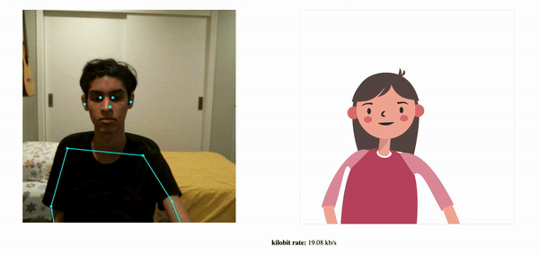

# Pose Animator for STEM to SHTEM

A twist on the conventional video streaming pipeline for the purposes of reductions in net latency. 

## Install, Build, Run

Do a recursive download:
```sh
git clone --recursive https://github.com/roshanprabhakar/pose-animator
```

Install dependencies and prepare the build directory:

```sh
yarn
```

Launch a live dev server while watching for changes:

```sh
yarn watch
```

The following might be useful if you face issues with the steps above:
- https://github.com/nodejs/node-gyp/issues/1927#issuecomment-661825834
- https://github.com/yemount/pose-animator/issues/12#issuecomment-626741765

The second link above no longer allows you to see the original script in chrome which is quite useful for debugging.

A better solution would be to NOT add --no-source-maps to package.json and instead replace the file node_modules/paper/dist/paper-full.js with a working copy available at https://pose-animator-demo.firebaseapp.com/node_modules/paper/dist/paper-full.js.


## Platform support

Demos are supported on Desktop Chrome and iOS Safari.

It should also run on Chrome on Android and potentially more Android mobile browsers though support has not been tested yet.


## Pose Animator

Pose Animator takes a 2D vector illustration and animates its containing curves in real-time based on the recognition result from PoseNet and FaceMesh. It borrows the idea of skeleton-based animation from computer graphics and applies it to vector characters.

This is running in the browser in realtime using [TensorFlow.js](https://www.tensorflow.org/js). Check out more cool TF.js demos [here](https://www.tensorflow.org/js/demos).

*This is not an officially supported Google product.*


In skeletal animation a character is represented in two parts:
1. a surface used to draw the character, and 
1. a hierarchical set of interconnected bones used to animate the surface. 

In Pose Animator, the surface is defined by the 2D vector paths in the input SVG files. For the bone structure, Pose Animator provides a predefined rig (bone hierarchy) representation, designed based on the keypoints from PoseNet and FaceMesh. This bone structure’s initial pose is specified in the input SVG file, along with the character illustration, while the real time bone positions are updated by the recognition result from ML models.


// TODO: Add blog post link.
For more details on its technical design please check out this blog post.

### Demo 1: [Camera feed](https://pose-animator-demo.firebaseapp.com/camera.html)

The camera demo animates a 2D avatar in real-time from a webcam video stream.


### Demo 2: [Static image](https://pose-animator-demo.firebaseapp.com/static_image.html)

The static image demo shows the avatar positioned from a single image.

# STEM to SHTEM 2020 Adaptation

Our goal was to provide a modification of the conventional video stream pipeline which competes with the original standard. <br>

We decided to modify the following pipeline: <br>
*Packet encoding &#8594; transmission of encoded data &#8594; Packet Decoding*

The premise of our project revolves around the theory that reducing the amount of transmitted data (and consequentially increasing the encoding/decoding computation time) will contribute to a net decrease in capture to render latency.

The conventional codec produces encoded packets that are representations of the entirety of the initial frame, with no biases implicit to any one feature within the frame. This allows for the near complete reconstruciton at the rendering end with the expense of creating encoded data that fully represents the video feed and thus is greater than it has to be for any specific stream use-case. With Pose Animator, we are able to stream data solely related to the structure of a person contained within the frame. Doing so allows us to drastically reduce the size of transmitted data, even if it does increase the encoding/pose-extracting and decoding/pose-projection computation induced time. 

We integrated the streaming of poses data into a web-rtc streaming framework, then throttled the stream bandwidth. Conclusively, we see that our method of video streaming allows for smooth, real time connectivity at drastically lower bandwidths (~12 kb/s independent) than those needed by the conventional stream (~300 kb/s resolution dependent). 

Although pose-animator does not provide a suitable animator for replacing today's streaming standard, this project demonstrates the potential of syncing an animator with a transmission service to provide a better video conferencing experience than that which exists today. 

Pose-animator stream (unbounded bandwidth) <br>
 <br>


Conventional stream (bounded by pose animator maximum consumed bandwidth) <br>
 <br>


Conventional stream (unbounded bandwidth) <br>
 <br>


# Animate your own design

1. Download the [sample skeleton SVG here](/resources/samples/skeleton.svg).
1. Create a new file in your vector graphics editor of choice. Copy the group named ‘skeleton’ from the above file into your working file. Note: 
	* Do not add, remove or rename the joints (circles) in this group. Pose Animator relies on these named paths to read the skeleton’s initial position. Missing joints will cause errors.
	* However you can move the joints around to embed them into your illustration. See step 4.
1. Create a new group and name it ‘illustration’, next to the ‘skeleton’ group. This is the group where you can put all the paths for your illustration.
    * Flatten all subgroups so that ‘illustration’ only contains path elements.
    * Composite paths are not supported at the moment.
    * The working file structure should look like this:
	```
        [Layer 1]
        |---- skeleton
        |---- illustration
              |---- path 1
              |---- path 2
              |---- path 3
	```
1. Embed the sample skeleton in ‘skeleton’ group into your illustration by moving the joints around.
1. Export the file as an SVG file.
1. Open [Pose Animator camera demo](https://pose-animator-demo.firebaseapp.com/camera.html). Once everything loads, drop your SVG file into the browser tab. You should be able to see it come to life :D
